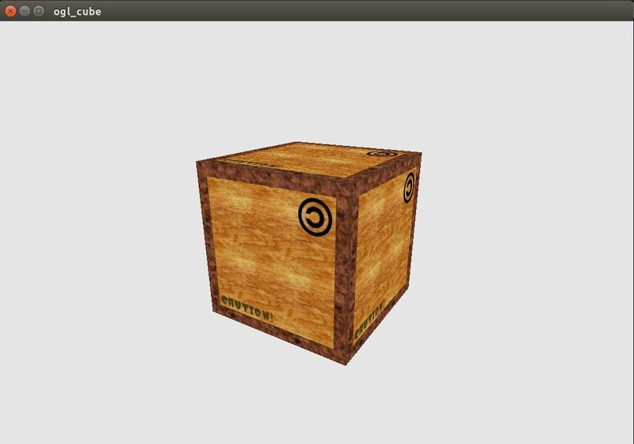

# ogl_cube
observe a cube with basic arcball camera


## build
use c++11 with opengl+glfw+glm, so make sure dependency before build. on ubuntu:
```
sudo apt-get install libglfw3-dev libglfw3 # glfw3
sudo apt-get install libglm-dev # glm
```
opengl 3.3 core profile

opengl is by defaul installed on most ubuntu, use " glxinfo | grep version " to check.
if not supported, consider use mesa driver from [oibaf graphics ppa](https://launchpad.net/~oibaf/+archive/ubuntu/graphics-drivers)

compile and test on ubuntu 14.04/16.04, intel gpu with mesa driver. to compile, run [build.sh](build.sh)

## misc
use "A,W,S,D" to turn camera, "R" to reset camera, use mouse scroll to zoom in/out

for opengl 330 core, if not properly run, need use
```
MESA_GL_VERSION_OVERRIDE=3.3 MESA_GLSL_VERSION_OVERRIDE=330  ./ogl_cube
```

https://www.mesa3d.org/envvars.html
mesa driver need env vars to enable 330 core support
